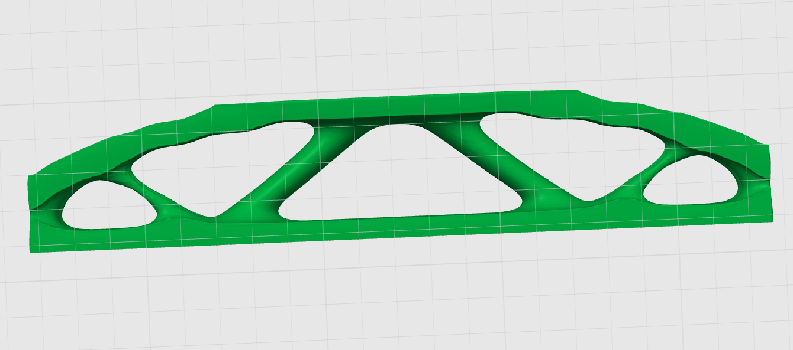

# MBB Topology Optimisation



This repository contains the accepted source code and STL artifacts for:

- an initial 2D MBB topology optimisation baseline;
- a recovered 3D MBB truss topology source;
- the recovered 3D print-refinement source used for HILT validation.

This project was developed as part of the SURE-program at Alfaisal University.

Failed/intermediate iterations are intentionally excluded from the GitHub package.

## OpenKB Structure

- [`OPENKB.md`](OPENKB.md) - curated knowledge index for this package.
- [`src/`](src/) - accepted Python source code.
- [`outputs/`](outputs/) - accepted STL artifacts and validation outputs.
- [`guardrails/`](guardrails/index.md) - handoffs, triage notes, and development guardrails.

## Included Source

2D baseline:

```text
src/mbb_beam_pymoto.py
```

Recovered 3D topology source:

```text
src/recovered/mbb_3d_truss_pymoto_recovered_3d_20260708_151202.py
```

Recovered 3D refinement source:

```text
src/recovered/refine_3d_print_mesh_recovered_refined_20260708_155144.py
```

## Included STL Files

2D baseline STL:

```text
outputs/runs/20260708_143004/mesh/optimized_mbb_beam.stl
```

Recovered 3D topology STL:

```text
outputs/runs/3d_20260708_151202/mesh/optimized_3d_mbb_truss_print_smooth.stl
```

Recovered 3D refined print STL:

```text
outputs/runs/refined_20260708_155144/mesh/optimized_3d_mbb_truss_refined_print.stl
```

## Verification

See:

```text
outputs/runs/20260708_143004/verification/watertightness.txt
outputs/runs/3d_20260708_151202/verification/watertightness.txt
outputs/runs/refined_20260708_155144/verification/refined_mesh_report.txt
```

## Dependencies

Install:

```powershell
python -m pip install -r requirements.txt
```

## HILT Validation

Recovered-source validation images are in:

```text
outputs/hilt_validation/
```

The sharpest comparison image is:

```text
outputs/hilt_validation/hilt_recovered_stl_orthographic_validation.png
```

## Copyright Boundary

PDF-derived material, converted article markdown, raw screenshots, and other copyrighted reference assets are intentionally excluded from this GitHub package.

The preview image above is included as a project result/validation visual supplied by the project author. The source PDF itself and converted PDF pages are not included.

## PDF Reference

The shell-infill design direction was informed by:

Wu, J., Clausen, A., and Sigmund, O. "Minimum Compliance Topology Optimization of Shell-Infill Composites for Additive Manufacturing." Computer Methods in Applied Mechanics and Engineering, 2017.

## References Cited In The PDF

The following bibliography entries are listed as citation metadata only. The PDF and converted article content are intentionally excluded from this repository.

1. M. P. Bendsoe and N. Kikuchi, "Generating optimal topologies in structural design using a homogenization method," Computer Methods in Applied Mechanics and Engineering, 71(2), 1988, pp. 197-224. doi:10.1016/0045-7825(88)90086-2.
2. M. P. Bendsoe and O. Sigmund, Topology Optimization: Theory, Methods, and Applications, Springer-Verlag Berlin Heidelberg, 2004.
3. O. Sigmund and K. Maute, "Topology optimization approaches," Structural and Multidisciplinary Optimization, 48(6), 2013, pp. 1031-1055. doi:10.1007/s00158-013-0978-6.
4. J. D. Deaton and R. V. Grandhi, "A survey of structural and multidisciplinary continuum topology optimization: post 2000," Structural and Multidisciplinary Optimization, 49(1), 2014, pp. 1-38. doi:10.1007/s00158-013-0956-z.
5. I. Gibson, D. W. Rosen, and B. Stucker, "Design for Additive Manufacturing," Springer US, Boston, MA, 2010, pp. 299-332. doi:10.1007/978-1-4419-1120-9_11.
6. W. Gao et al., "The status, challenges, and future of additive manufacturing in engineering," Computer-Aided Design, 69, 2015, pp. 65-89. doi:10.1016/j.cad.2015.04.001.
7. A. Clausen, N. Aage, and O. Sigmund, "Exploiting additive manufacturing infill in topology optimization for improved buckling load," Engineering, 2(2), 2016, pp. 250-257. doi:10.1016/J.ENG.2016.02.006.
8. J. Wu, N. Aage, R. Westermann, and O. Sigmund, "Infill optimization for additive manufacturing - approaching bone-like porous structures," IEEE Transactions on Visualization and Computer Graphics, 2017. doi:10.1109/TVCG.2017.2655523.
9. M. P. Bendsoe and O. Sigmund, "Material interpolation schemes in topology optimization," Archive of Applied Mechanics, 69(9-10), 1999, pp. 635-654. doi:10.1007/s004190050248.
10. A. Clausen, N. Aage, and O. Sigmund, "Topology optimization of coated structures and material interface problems," Computer Methods in Applied Mechanics and Engineering, 290, 2015, pp. 524-541. doi:10.1016/j.cma.2015.02.011.
11. A. Clausen, E. Andreassen, and O. Sigmund, "Topology optimization of 3D shell structures with porous infill," Acta Mechanica Sinica.
12. J. Guest, "Imposing maximum length scale in topology optimization," Structural and Multidisciplinary Optimization, 37(5), 2009, pp. 463-473. doi:10.1007/s00158-008-0250-7.
13. B. S. Lazarov and F. Wang, "Maximum length scale in density based topology optimization," Computer Methods in Applied Mechanics and Engineering, 318, 2017, pp. 826-844. doi:10.1016/j.cma.2017.02.018.
14. F. Wang, B. S. Lazarov, and O. Sigmund, "On projection methods, convergence and robust formulations in topology optimization," Structural and Multidisciplinary Optimization, 43(6), 2010, pp. 767-784. doi:10.1007/s00158-010-0602-y.
15. M. Langelaar, "An additive manufacturing filter for topology optimization of print-ready designs," Structural and Multidisciplinary Optimization, 2016. doi:10.1007/s00158-016-1522-2.
16. X. Qian, "Undercut and overhang angle control in topology optimization: a density gradient based integral approach," International Journal for Numerical Methods in Engineering. doi:10.1002/nme.5461.
17. A. T. Gaynor and J. K. Guest, "Topology optimization considering overhang constraints: eliminating sacrificial support material in additive manufacturing through design," Structural and Multidisciplinary Optimization, 54(5), 2016, pp. 1157-1172. doi:10.1007/s00158-016-1551-x.
18. J. K. Guest, J. Prevost, and T. Belytschko, "Achieving minimum length scale in topology optimization using nodal design variables and projection functions," International Journal for Numerical Methods in Engineering, 61(2), 2004, pp. 238-254. doi:10.1002/nme.1064.
19. O. Sigmund, "Morphology-based black and white filters for topology optimization," Structural and Multidisciplinary Optimization, 33(4), 2007, pp. 401-424. doi:10.1007/s00158-006-0087-x.
20. S. Xu, Y. Cai, and G. Cheng, "Volume preserving nonlinear density filter based on Heaviside functions," Structural and Multidisciplinary Optimization, 41(4), 2010, pp. 495-505. doi:10.1007/s00158-009-0452-7.
21. J. Wu, C. C. Wang, X. Zhang, and R. Westermann, "Self-supporting rhombic infill structures for additive manufacturing," Computer-Aided Design, 80, 2016, pp. 32-42. doi:10.1016/j.cad.2016.07.006.
22. B. S. Lazarov, F. Wang, and O. Sigmund, "Length scale and manufacturability in density-based topology optimization," Archive of Applied Mechanics, 86(1), 2016, pp. 189-218. doi:10.1007/s00419-015-1106-4.
23. O. Sigmund, "Design of multiphysics actuators using topology optimization part II: two-material structures," Computer Methods in Applied Mechanics and Engineering, 190, 2001, pp. 6605-6627. doi:10.1016/S0045-7825(01)00252-3.
24. A. Diaz and O. Sigmund, "Checkerboard patterns in layout optimization," Structural Optimization, 10(1), 1995, pp. 40-45. doi:10.1007/BF01743693.
25. B. S. Lazarov and O. Sigmund, "Filters in topology optimization based on Helmholtz-type differential equations," International Journal for Numerical Methods in Engineering, 86(6), 2011, pp. 765-781. doi:10.1002/nme.3072.
26. K. Svanberg, "The method of moving asymptotes - a new method for structural optimization," International Journal for Numerical Methods in Engineering, 24(2), 1987, pp. 359-373. doi:10.1002/nme.1620240207.
27. O. Sigmund, "Manufacturing tolerant topology optimization," Acta Mechanica Sinica, 25(2), 2009, pp. 227-239. doi:10.1007/s10409-009-0240-z.
28. A. Clausen and E. Andreassen, "On filter boundary conditions in topology optimization," Structural and Multidisciplinary Optimization. doi:10.1007/s00158-017-1709-1.
29. Z. Hashin and S. Shtrikman, "A variational approach to the theory of the elastic behaviour of multiphase materials," Journal of the Mechanics and Physics of Solids, 11(2), 1963, pp. 127-140. doi:10.1016/0022-5096(63)90060-7.
